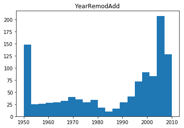
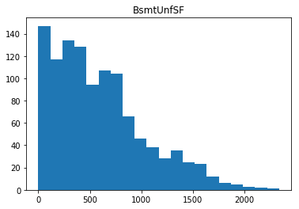

# Objectives
YWBAT
* list the assumptions of OLS
* explain why multicollinearity is bad both predictively and mathematically
* summarize a statsmodels summary of an OLS


```python
import numpy as np
import pandas as pd
import statsmodels.api as sm
import scipy.stats as scs

import matplotlib.pyplot as plt
import seaborn as sns
```


```python
df = pd.read_csv("ames.csv")
df.head()
```


<div>
<style scoped>
    .dataframe tbody tr th:only-of-type {
        vertical-align: middle;
    }

    .dataframe tbody tr th {
        vertical-align: top;
    }

    .dataframe thead th {
        text-align: right;
    }
</style>
<table border="1" class="dataframe">
  <thead>
    <tr style="text-align: right;">
      <th></th>
      <th>Id</th>
      <th>MSSubClass</th>
      <th>MSZoning</th>
      <th>LotFrontage</th>
      <th>LotArea</th>
      <th>Street</th>
      <th>Alley</th>
      <th>LotShape</th>
      <th>LandContour</th>
      <th>Utilities</th>
      <th>...</th>
      <th>PoolArea</th>
      <th>PoolQC</th>
      <th>Fence</th>
      <th>MiscFeature</th>
      <th>MiscVal</th>
      <th>MoSold</th>
      <th>YrSold</th>
      <th>SaleType</th>
      <th>SaleCondition</th>
      <th>SalePrice</th>
    </tr>
  </thead>
  <tbody>
    <tr>
      <td>0</td>
      <td>1</td>
      <td>60</td>
      <td>RL</td>
      <td>65.0</td>
      <td>8450</td>
      <td>Pave</td>
      <td>NaN</td>
      <td>Reg</td>
      <td>Lvl</td>
      <td>AllPub</td>
      <td>...</td>
      <td>0</td>
      <td>NaN</td>
      <td>NaN</td>
      <td>NaN</td>
      <td>0</td>
      <td>2</td>
      <td>2008</td>
      <td>WD</td>
      <td>Normal</td>
      <td>208500</td>
    </tr>
    <tr>
      <td>1</td>
      <td>2</td>
      <td>20</td>
      <td>RL</td>
      <td>80.0</td>
      <td>9600</td>
      <td>Pave</td>
      <td>NaN</td>
      <td>Reg</td>
      <td>Lvl</td>
      <td>AllPub</td>
      <td>...</td>
      <td>0</td>
      <td>NaN</td>
      <td>NaN</td>
      <td>NaN</td>
      <td>0</td>
      <td>5</td>
      <td>2007</td>
      <td>WD</td>
      <td>Normal</td>
      <td>181500</td>
    </tr>
    <tr>
      <td>2</td>
      <td>3</td>
      <td>60</td>
      <td>RL</td>
      <td>68.0</td>
      <td>11250</td>
      <td>Pave</td>
      <td>NaN</td>
      <td>IR1</td>
      <td>Lvl</td>
      <td>AllPub</td>
      <td>...</td>
      <td>0</td>
      <td>NaN</td>
      <td>NaN</td>
      <td>NaN</td>
      <td>0</td>
      <td>9</td>
      <td>2008</td>
      <td>WD</td>
      <td>Normal</td>
      <td>223500</td>
    </tr>
    <tr>
      <td>3</td>
      <td>4</td>
      <td>70</td>
      <td>RL</td>
      <td>60.0</td>
      <td>9550</td>
      <td>Pave</td>
      <td>NaN</td>
      <td>IR1</td>
      <td>Lvl</td>
      <td>AllPub</td>
      <td>...</td>
      <td>0</td>
      <td>NaN</td>
      <td>NaN</td>
      <td>NaN</td>
      <td>0</td>
      <td>2</td>
      <td>2006</td>
      <td>WD</td>
      <td>Abnorml</td>
      <td>140000</td>
    </tr>
    <tr>
      <td>4</td>
      <td>5</td>
      <td>60</td>
      <td>RL</td>
      <td>84.0</td>
      <td>14260</td>
      <td>Pave</td>
      <td>NaN</td>
      <td>IR1</td>
      <td>Lvl</td>
      <td>AllPub</td>
      <td>...</td>
      <td>0</td>
      <td>NaN</td>
      <td>NaN</td>
      <td>NaN</td>
      <td>0</td>
      <td>12</td>
      <td>2008</td>
      <td>WD</td>
      <td>Normal</td>
      <td>250000</td>
    </tr>
  </tbody>
</table>
<p>5 rows × 81 columns</p>
</div>


# Assumptions of Linear Regression
* linearity: the relationship between the predictors and the target is linear
* Homoskedacicity: the variance of the residuals is equivalent for any given X. Error is normally distributed. 
* X values are independent. All of the rows of data are independent from one another.
    * no multicollinearity
    * use linear regression on your features to check for this (VIF)
* Y is normally distributed


# To do modeling it's best to follow the OSEMN Process


* [X] Obtain
* [ ] Scrub, skip
* [X] Explore
* [X] Model 
* [X] Interpret


```python
df.info()
```

    <class 'pandas.core.frame.DataFrame'>
    RangeIndex: 1460 entries, 0 to 1459
    Data columns (total 81 columns):
    Id               1460 non-null int64
    MSSubClass       1460 non-null int64
    MSZoning         1460 non-null object
    LotFrontage      1201 non-null float64
    LotArea          1460 non-null int64
    Street           1460 non-null object
    Alley            91 non-null object
    LotShape         1460 non-null object
    LandContour      1460 non-null object
    Utilities        1460 non-null object
    LotConfig        1460 non-null object
    LandSlope        1460 non-null object
    Neighborhood     1460 non-null object
    Condition1       1460 non-null object
    Condition2       1460 non-null object
    BldgType         1460 non-null object
    HouseStyle       1460 non-null object
    OverallQual      1460 non-null int64
    OverallCond      1460 non-null int64
    YearBuilt        1460 non-null int64
    YearRemodAdd     1460 non-null int64
    RoofStyle        1460 non-null object
    RoofMatl         1460 non-null object
    Exterior1st      1460 non-null object
    Exterior2nd      1460 non-null object
    MasVnrType       1452 non-null object
    MasVnrArea       1452 non-null float64
    ExterQual        1460 non-null object
    ExterCond        1460 non-null object
    Foundation       1460 non-null object
    BsmtQual         1423 non-null object
    BsmtCond         1423 non-null object
    BsmtExposure     1422 non-null object
    BsmtFinType1     1423 non-null object
    BsmtFinSF1       1460 non-null int64
    BsmtFinType2     1422 non-null object
    BsmtFinSF2       1460 non-null int64
    BsmtUnfSF        1460 non-null int64
    TotalBsmtSF      1460 non-null int64
    Heating          1460 non-null object
    HeatingQC        1460 non-null object
    CentralAir       1460 non-null object
    Electrical       1459 non-null object
    1stFlrSF         1460 non-null int64
    2ndFlrSF         1460 non-null int64
    LowQualFinSF     1460 non-null int64
    GrLivArea        1460 non-null int64
    BsmtFullBath     1460 non-null int64
    BsmtHalfBath     1460 non-null int64
    FullBath         1460 non-null int64
    HalfBath         1460 non-null int64
    BedroomAbvGr     1460 non-null int64
    KitchenAbvGr     1460 non-null int64
    KitchenQual      1460 non-null object
    TotRmsAbvGrd     1460 non-null int64
    Functional       1460 non-null object
    Fireplaces       1460 non-null int64
    FireplaceQu      770 non-null object
    GarageType       1379 non-null object
    GarageYrBlt      1379 non-null float64
    GarageFinish     1379 non-null object
    GarageCars       1460 non-null int64
    GarageArea       1460 non-null int64
    GarageQual       1379 non-null object
    GarageCond       1379 non-null object
    PavedDrive       1460 non-null object
    WoodDeckSF       1460 non-null int64
    OpenPorchSF      1460 non-null int64
    EnclosedPorch    1460 non-null int64
    3SsnPorch        1460 non-null int64
    ScreenPorch      1460 non-null int64
    PoolArea         1460 non-null int64
    PoolQC           7 non-null object
    Fence            281 non-null object
    MiscFeature      54 non-null object
    MiscVal          1460 non-null int64
    MoSold           1460 non-null int64
    YrSold           1460 non-null int64
    SaleType         1460 non-null object
    SaleCondition    1460 non-null object
    SalePrice        1460 non-null int64
    dtypes: float64(3), int64(35), object(43)
    memory usage: 924.0+ KB


```python
# Explore it
numerical_cols = []
for col in df.columns:
    if df[col].dtype in [np.int64, np.float64]:
        numerical_cols.append(col)

len(numerical_cols), numerical_cols[:5]
```


    (38, ['Id', 'MSSubClass', 'LotFrontage', 'LotArea', 'OverallQual'])


```python
numerical_df = df[numerical_cols]
numerical_df.head()
```


<div>
<style scoped>
    .dataframe tbody tr th:only-of-type {
        vertical-align: middle;
    }

    .dataframe tbody tr th {
        vertical-align: top;
    }

    .dataframe thead th {
        text-align: right;
    }
</style>
<table border="1" class="dataframe">
  <thead>
    <tr style="text-align: right;">
      <th></th>
      <th>Id</th>
      <th>MSSubClass</th>
      <th>LotFrontage</th>
      <th>LotArea</th>
      <th>OverallQual</th>
      <th>OverallCond</th>
      <th>YearBuilt</th>
      <th>YearRemodAdd</th>
      <th>MasVnrArea</th>
      <th>BsmtFinSF1</th>
      <th>...</th>
      <th>WoodDeckSF</th>
      <th>OpenPorchSF</th>
      <th>EnclosedPorch</th>
      <th>3SsnPorch</th>
      <th>ScreenPorch</th>
      <th>PoolArea</th>
      <th>MiscVal</th>
      <th>MoSold</th>
      <th>YrSold</th>
      <th>SalePrice</th>
    </tr>
  </thead>
  <tbody>
    <tr>
      <td>0</td>
      <td>1</td>
      <td>60</td>
      <td>65.0</td>
      <td>8450</td>
      <td>7</td>
      <td>5</td>
      <td>2003</td>
      <td>2003</td>
      <td>196.0</td>
      <td>706</td>
      <td>...</td>
      <td>0</td>
      <td>61</td>
      <td>0</td>
      <td>0</td>
      <td>0</td>
      <td>0</td>
      <td>0</td>
      <td>2</td>
      <td>2008</td>
      <td>208500</td>
    </tr>
    <tr>
      <td>1</td>
      <td>2</td>
      <td>20</td>
      <td>80.0</td>
      <td>9600</td>
      <td>6</td>
      <td>8</td>
      <td>1976</td>
      <td>1976</td>
      <td>0.0</td>
      <td>978</td>
      <td>...</td>
      <td>298</td>
      <td>0</td>
      <td>0</td>
      <td>0</td>
      <td>0</td>
      <td>0</td>
      <td>0</td>
      <td>5</td>
      <td>2007</td>
      <td>181500</td>
    </tr>
    <tr>
      <td>2</td>
      <td>3</td>
      <td>60</td>
      <td>68.0</td>
      <td>11250</td>
      <td>7</td>
      <td>5</td>
      <td>2001</td>
      <td>2002</td>
      <td>162.0</td>
      <td>486</td>
      <td>...</td>
      <td>0</td>
      <td>42</td>
      <td>0</td>
      <td>0</td>
      <td>0</td>
      <td>0</td>
      <td>0</td>
      <td>9</td>
      <td>2008</td>
      <td>223500</td>
    </tr>
    <tr>
      <td>3</td>
      <td>4</td>
      <td>70</td>
      <td>60.0</td>
      <td>9550</td>
      <td>7</td>
      <td>5</td>
      <td>1915</td>
      <td>1970</td>
      <td>0.0</td>
      <td>216</td>
      <td>...</td>
      <td>0</td>
      <td>35</td>
      <td>272</td>
      <td>0</td>
      <td>0</td>
      <td>0</td>
      <td>0</td>
      <td>2</td>
      <td>2006</td>
      <td>140000</td>
    </tr>
    <tr>
      <td>4</td>
      <td>5</td>
      <td>60</td>
      <td>84.0</td>
      <td>14260</td>
      <td>8</td>
      <td>5</td>
      <td>2000</td>
      <td>2000</td>
      <td>350.0</td>
      <td>655</td>
      <td>...</td>
      <td>192</td>
      <td>84</td>
      <td>0</td>
      <td>0</td>
      <td>0</td>
      <td>0</td>
      <td>0</td>
      <td>12</td>
      <td>2008</td>
      <td>250000</td>
    </tr>
  </tbody>
</table>
<p>5 rows × 38 columns</p>
</div>


# categorical data is data that is a category and order would not make sense


```python
numerical_df.isna().sum()/numerical_df.shape[0]
```


    Id               0.000000
    MSSubClass       0.000000
    LotFrontage      0.177397
    LotArea          0.000000
    OverallQual      0.000000
    OverallCond      0.000000
    YearBuilt        0.000000
    YearRemodAdd     0.000000
    MasVnrArea       0.005479
    BsmtFinSF1       0.000000
    BsmtFinSF2       0.000000
    BsmtUnfSF        0.000000
    TotalBsmtSF      0.000000
    1stFlrSF         0.000000
    2ndFlrSF         0.000000
    LowQualFinSF     0.000000
    GrLivArea        0.000000
    BsmtFullBath     0.000000
    BsmtHalfBath     0.000000
    FullBath         0.000000
    HalfBath         0.000000
    BedroomAbvGr     0.000000
    KitchenAbvGr     0.000000
    TotRmsAbvGrd     0.000000
    Fireplaces       0.000000
    GarageYrBlt      0.055479
    GarageCars       0.000000
    GarageArea       0.000000
    WoodDeckSF       0.000000
    OpenPorchSF      0.000000
    EnclosedPorch    0.000000
    3SsnPorch        0.000000
    ScreenPorch      0.000000
    PoolArea         0.000000
    MiscVal          0.000000
    MoSold           0.000000
    YrSold           0.000000
    SalePrice        0.000000
    dtype: float64


```python

```

# Let's just build an OLS model


```python
cols = ["LotArea", "BsmtFinSF1", "GrLivArea", "MasVnrArea", "Fireplaces"]
```


```python
numerical_df_samp = numerical_df[cols]
numerical_df_samp.head()
```


<div>
<style scoped>
    .dataframe tbody tr th:only-of-type {
        vertical-align: middle;
    }

    .dataframe tbody tr th {
        vertical-align: top;
    }

    .dataframe thead th {
        text-align: right;
    }
</style>
<table border="1" class="dataframe">
  <thead>
    <tr style="text-align: right;">
      <th></th>
      <th>LotArea</th>
      <th>BsmtFinSF1</th>
      <th>GrLivArea</th>
      <th>MasVnrArea</th>
      <th>Fireplaces</th>
    </tr>
  </thead>
  <tbody>
    <tr>
      <td>0</td>
      <td>8450</td>
      <td>706</td>
      <td>1710</td>
      <td>196.0</td>
      <td>0</td>
    </tr>
    <tr>
      <td>1</td>
      <td>9600</td>
      <td>978</td>
      <td>1262</td>
      <td>0.0</td>
      <td>1</td>
    </tr>
    <tr>
      <td>2</td>
      <td>11250</td>
      <td>486</td>
      <td>1786</td>
      <td>162.0</td>
      <td>1</td>
    </tr>
    <tr>
      <td>3</td>
      <td>9550</td>
      <td>216</td>
      <td>1717</td>
      <td>0.0</td>
      <td>1</td>
    </tr>
    <tr>
      <td>4</td>
      <td>14260</td>
      <td>655</td>
      <td>2198</td>
      <td>350.0</td>
      <td>1</td>
    </tr>
  </tbody>
</table>
</div>


# What is the goal of linear regression? 
* can we make a linear equation to predict the saleprice? 

saleprice_hat = B0 + B1xLotArea + B2xBsmtFinSF1 + ... + B5xFireplaces

* adding multiple terms makes it polynomial
* what is making this equation linear? 
    * the features are all a power of 1
* what are we solving for when we do linear regression? 
    * beta coefficients


```python
X = numerical_df[cols]
X.head()
```


<div>
<style scoped>
    .dataframe tbody tr th:only-of-type {
        vertical-align: middle;
    }

    .dataframe tbody tr th {
        vertical-align: top;
    }

    .dataframe thead th {
        text-align: right;
    }
</style>
<table border="1" class="dataframe">
  <thead>
    <tr style="text-align: right;">
      <th></th>
      <th>LotArea</th>
      <th>BsmtFinSF1</th>
      <th>GrLivArea</th>
      <th>MasVnrArea</th>
      <th>Fireplaces</th>
    </tr>
  </thead>
  <tbody>
    <tr>
      <td>0</td>
      <td>8450</td>
      <td>706</td>
      <td>1710</td>
      <td>196.0</td>
      <td>0</td>
    </tr>
    <tr>
      <td>1</td>
      <td>9600</td>
      <td>978</td>
      <td>1262</td>
      <td>0.0</td>
      <td>1</td>
    </tr>
    <tr>
      <td>2</td>
      <td>11250</td>
      <td>486</td>
      <td>1786</td>
      <td>162.0</td>
      <td>1</td>
    </tr>
    <tr>
      <td>3</td>
      <td>9550</td>
      <td>216</td>
      <td>1717</td>
      <td>0.0</td>
      <td>1</td>
    </tr>
    <tr>
      <td>4</td>
      <td>14260</td>
      <td>655</td>
      <td>2198</td>
      <td>350.0</td>
      <td>1</td>
    </tr>
  </tbody>
</table>
</div>


```python
X = sm.add_constant(X)
X.head()
```

    /Users/rafael/anaconda3/envs/flatiron-env/lib/python3.6/site-packages/numpy/core/fromnumeric.py:2389: FutureWarning: Method .ptp is deprecated and will be removed in a future version. Use numpy.ptp instead.
      return ptp(axis=axis, out=out, **kwargs)


<div>
<style scoped>
    .dataframe tbody tr th:only-of-type {
        vertical-align: middle;
    }

    .dataframe tbody tr th {
        vertical-align: top;
    }

    .dataframe thead th {
        text-align: right;
    }
</style>
<table border="1" class="dataframe">
  <thead>
    <tr style="text-align: right;">
      <th></th>
      <th>const</th>
      <th>LotArea</th>
      <th>BsmtFinSF1</th>
      <th>GrLivArea</th>
      <th>MasVnrArea</th>
      <th>Fireplaces</th>
    </tr>
  </thead>
  <tbody>
    <tr>
      <td>0</td>
      <td>1.0</td>
      <td>8450</td>
      <td>706</td>
      <td>1710</td>
      <td>196.0</td>
      <td>0</td>
    </tr>
    <tr>
      <td>1</td>
      <td>1.0</td>
      <td>9600</td>
      <td>978</td>
      <td>1262</td>
      <td>0.0</td>
      <td>1</td>
    </tr>
    <tr>
      <td>2</td>
      <td>1.0</td>
      <td>11250</td>
      <td>486</td>
      <td>1786</td>
      <td>162.0</td>
      <td>1</td>
    </tr>
    <tr>
      <td>3</td>
      <td>1.0</td>
      <td>9550</td>
      <td>216</td>
      <td>1717</td>
      <td>0.0</td>
      <td>1</td>
    </tr>
    <tr>
      <td>4</td>
      <td>1.0</td>
      <td>14260</td>
      <td>655</td>
      <td>2198</td>
      <td>350.0</td>
      <td>1</td>
    </tr>
  </tbody>
</table>
</div>


```python
y = numerical_df['SalePrice']
y.head()
```


    0    208500
    1    181500
    2    223500
    3    140000
    4    250000
    Name: SalePrice, dtype: int64


```python
numerical_df.dropna(axis=0, inplace=True)
X = numerical_df[cols] # create your X data
X = sm.add_constant(X) # add a constant
y = numerical_df['SalePrice'] # got our target data
```

    /Users/rafael/anaconda3/envs/flatiron-env/lib/python3.6/site-packages/ipykernel_launcher.py:1: SettingWithCopyWarning: 
    A value is trying to be set on a copy of a slice from a DataFrame
    
    See the caveats in the documentation: http://pandas.pydata.org/pandas-docs/stable/user_guide/indexing.html#returning-a-view-versus-a-copy
      """Entry point for launching an IPython kernel.


```python
ols = sm.OLS(y, X)
results = ols.fit()
results.summary()
```


<table class="simpletable">
<caption>OLS Regression Results</caption>
<tr>
  <th>Dep. Variable:</th>        <td>SalePrice</td>    <th>  R-squared:         </th> <td>   0.591</td> 
</tr>
<tr>
  <th>Model:</th>                   <td>OLS</td>       <th>  Adj. R-squared:    </th> <td>   0.590</td> 
</tr>
<tr>
  <th>Method:</th>             <td>Least Squares</td>  <th>  F-statistic:       </th> <td>   322.8</td> 
</tr>
<tr>
  <th>Date:</th>             <td>Thu, 28 May 2020</td> <th>  Prob (F-statistic):</th> <td>8.39e-214</td>
</tr>
<tr>
  <th>Time:</th>                 <td>13:12:01</td>     <th>  Log-Likelihood:    </th> <td> -13786.</td> 
</tr>
<tr>
  <th>No. Observations:</th>      <td>  1121</td>      <th>  AIC:               </th> <td>2.758e+04</td>
</tr>
<tr>
  <th>Df Residuals:</th>          <td>  1115</td>      <th>  BIC:               </th> <td>2.761e+04</td>
</tr>
<tr>
  <th>Df Model:</th>              <td>     5</td>      <th>                     </th>     <td> </td>    
</tr>
<tr>
  <th>Covariance Type:</th>      <td>nonrobust</td>    <th>                     </th>     <td> </td>    
</tr>
</table>
<table class="simpletable">
<tr>
       <td></td>         <th>coef</th>     <th>std err</th>      <th>t</th>      <th>P>|t|</th>  <th>[0.025</th>    <th>0.975]</th>  
</tr>
<tr>
  <th>const</th>      <td> 2.364e+04</td> <td> 5165.184</td> <td>    4.576</td> <td> 0.000</td> <td> 1.35e+04</td> <td> 3.38e+04</td>
</tr>
<tr>
  <th>LotArea</th>    <td>    0.5483</td> <td>    0.210</td> <td>    2.611</td> <td> 0.009</td> <td>    0.136</td> <td>    0.960</td>
</tr>
<tr>
  <th>BsmtFinSF1</th> <td>   29.9726</td> <td>    3.676</td> <td>    8.154</td> <td> 0.000</td> <td>   22.760</td> <td>   37.185</td>
</tr>
<tr>
  <th>GrLivArea</th>  <td>   81.7819</td> <td>    3.755</td> <td>   21.777</td> <td> 0.000</td> <td>   74.413</td> <td>   89.151</td>
</tr>
<tr>
  <th>MasVnrArea</th> <td>   84.5858</td> <td>    9.448</td> <td>    8.953</td> <td> 0.000</td> <td>   66.048</td> <td>  103.123</td>
</tr>
<tr>
  <th>Fireplaces</th> <td> 1.451e+04</td> <td> 2915.011</td> <td>    4.977</td> <td> 0.000</td> <td> 8787.470</td> <td> 2.02e+04</td>
</tr>
</table>
<table class="simpletable">
<tr>
  <th>Omnibus:</th>       <td>484.168</td> <th>  Durbin-Watson:     </th> <td>   1.985</td> 
</tr>
<tr>
  <th>Prob(Omnibus):</th> <td> 0.000</td>  <th>  Jarque-Bera (JB):  </th> <td>25222.017</td>
</tr>
<tr>
  <th>Skew:</th>          <td>-1.203</td>  <th>  Prob(JB):          </th> <td>    0.00</td> 
</tr>
<tr>
  <th>Kurtosis:</th>      <td>26.113</td>  <th>  Cond. No.          </th> <td>4.27e+04</td> 
</tr>
</table><br/><br/>Warnings:<br/>[1] Standard Errors assume that the covariance matrix of the errors is correctly specified.<br/>[2] The condition number is large, 4.27e+04. This might indicate that there are<br/>strong multicollinearity or other numerical problems.


# Why does multicollinearity ruin a model?
* if 1 feature is correlated with 2 or more features than a change in that feature will cause change in the other features. 
* it creates more weight towards the correlated features 
* there is no signal coming from correlated features 
* there is no solution mathematically to your system of equations

# Visualize Residuals! 


```python
residuals = results.resid
```


```python
# histogram
```


```python
plt.figure(figsize=(8, 5))
plt.hist(residuals)
plt.show()
```


```python
# scatterplot
```


```python
x = np.linspace(0, 1, len(residuals))
```


```python
plt.figure(figsize=(8, 5))
plt.scatter(x, residuals)
plt.xlabel("x axis")
plt.ylabel("residuals")
plt.hlines(xmin=0, xmax=1, y=0, label="y_hat")
plt.show()
```


```python
# We want our scatterplot
# evenly spaced around 0
# no outliers
```


```python
scs.kstest(scs.zscore(residuals), 'norm', args=(0, 1))
```


    KstestResult(statistic=0.08271013001644745, pvalue=4.047882956342313e-07)


```python
scs.shapiro(residuals)
```


    (0.8694653511047363, 1.4159442969666034e-29)


### What did we learn today? 
* in linear regression we're looking for beta coefficients 
* osemn process
    * great process for building models
* the 4 assumptions of linear regression
    * linearity
    * homoskedacicity
    * y is normally distributed
    * xvalues are independent 
* why multicollinearity ruins a model
* continuous and categorical data 

## Objectives
YWBAT (You Will Be Able To)
* transform data to normalize it 
    * explain the rational behind normalizing data
* explain what standardization does
* Test for multicollinearity using a VIF Test

# Transformations
* normalization - make data more like a normal distribution
* standardization - scaling the data 


```python
numerical_df.head()
```


<div>
<style scoped>
    .dataframe tbody tr th:only-of-type {
        vertical-align: middle;
    }

    .dataframe tbody tr th {
        vertical-align: top;
    }

    .dataframe thead th {
        text-align: right;
    }
</style>
<table border="1" class="dataframe">
  <thead>
    <tr style="text-align: right;">
      <th></th>
      <th>Id</th>
      <th>MSSubClass</th>
      <th>LotFrontage</th>
      <th>LotArea</th>
      <th>OverallQual</th>
      <th>OverallCond</th>
      <th>YearBuilt</th>
      <th>YearRemodAdd</th>
      <th>MasVnrArea</th>
      <th>BsmtFinSF1</th>
      <th>...</th>
      <th>WoodDeckSF</th>
      <th>OpenPorchSF</th>
      <th>EnclosedPorch</th>
      <th>3SsnPorch</th>
      <th>ScreenPorch</th>
      <th>PoolArea</th>
      <th>MiscVal</th>
      <th>MoSold</th>
      <th>YrSold</th>
      <th>SalePrice</th>
    </tr>
  </thead>
  <tbody>
    <tr>
      <td>0</td>
      <td>1</td>
      <td>60</td>
      <td>65.0</td>
      <td>8450</td>
      <td>7</td>
      <td>5</td>
      <td>2003</td>
      <td>2003</td>
      <td>196.0</td>
      <td>706</td>
      <td>...</td>
      <td>0</td>
      <td>61</td>
      <td>0</td>
      <td>0</td>
      <td>0</td>
      <td>0</td>
      <td>0</td>
      <td>2</td>
      <td>2008</td>
      <td>208500</td>
    </tr>
    <tr>
      <td>1</td>
      <td>2</td>
      <td>20</td>
      <td>80.0</td>
      <td>9600</td>
      <td>6</td>
      <td>8</td>
      <td>1976</td>
      <td>1976</td>
      <td>0.0</td>
      <td>978</td>
      <td>...</td>
      <td>298</td>
      <td>0</td>
      <td>0</td>
      <td>0</td>
      <td>0</td>
      <td>0</td>
      <td>0</td>
      <td>5</td>
      <td>2007</td>
      <td>181500</td>
    </tr>
    <tr>
      <td>2</td>
      <td>3</td>
      <td>60</td>
      <td>68.0</td>
      <td>11250</td>
      <td>7</td>
      <td>5</td>
      <td>2001</td>
      <td>2002</td>
      <td>162.0</td>
      <td>486</td>
      <td>...</td>
      <td>0</td>
      <td>42</td>
      <td>0</td>
      <td>0</td>
      <td>0</td>
      <td>0</td>
      <td>0</td>
      <td>9</td>
      <td>2008</td>
      <td>223500</td>
    </tr>
    <tr>
      <td>3</td>
      <td>4</td>
      <td>70</td>
      <td>60.0</td>
      <td>9550</td>
      <td>7</td>
      <td>5</td>
      <td>1915</td>
      <td>1970</td>
      <td>0.0</td>
      <td>216</td>
      <td>...</td>
      <td>0</td>
      <td>35</td>
      <td>272</td>
      <td>0</td>
      <td>0</td>
      <td>0</td>
      <td>0</td>
      <td>2</td>
      <td>2006</td>
      <td>140000</td>
    </tr>
    <tr>
      <td>4</td>
      <td>5</td>
      <td>60</td>
      <td>84.0</td>
      <td>14260</td>
      <td>8</td>
      <td>5</td>
      <td>2000</td>
      <td>2000</td>
      <td>350.0</td>
      <td>655</td>
      <td>...</td>
      <td>192</td>
      <td>84</td>
      <td>0</td>
      <td>0</td>
      <td>0</td>
      <td>0</td>
      <td>0</td>
      <td>12</td>
      <td>2008</td>
      <td>250000</td>
    </tr>
  </tbody>
</table>
<p>5 rows × 38 columns</p>
</div>


# Transform data - normalization
* log transormations
* boxcox transformations


```python
for col in numerical_df.columns:
    plt.hist(numerical_df[col], bins=20)
    plt.title(col)
    plt.show()
```








```python
lot_frontage = numerical_df['LotFrontage']
plt.hist(lot_frontage)
plt.show()
```


```python
log_lot_frontage = np.log(lot_frontage)
plt.hist(log_lot_frontage)
plt.show()
```


```python
np.exp(5) # e = 2.718.... 2.718^? = 148.413
```


    148.4131591025766


```python
np.log(148.4131591025766)
```


    5.0


```python
np.log(200)
```


    5.298317366548036


```python
np.log(300), np.log(200)
```


    (5.703782474656201, 5.298317366548036)


# Comparing the skewness and kurtosis we see that both scores get much closer to 0


```python
scs.skew(lot_frontage), scs.kurtosis(lot_frontage)
```


    (2.2481832382080698, 18.356938419863447)


```python
scs.skew(log_lot_frontage), scs.kurtosis(log_lot_frontage)
```


    (-0.7453562715504678, 2.4194490925703844)


# Log Transformations
* Pros
    * normalizes data 
* Cons
    * Interpreting a log is difficult

# Box Cox Transformation


```python
bc_lot_frontage, lam = scs.boxcox(lot_frontage)
```


```python
plt.hist(bc_lot_frontage)
plt.show()
```


```python
scs.skew(bc_lot_frontage), scs.kurtosis(bc_lot_frontage)
```


    (0.12110392077998999, 3.3689474840388636)


# Boxcox in Sklearn - without standardization


```python
from sklearn.preprocessing import PowerTransformer
```


```python
pt = PowerTransformer(method='box-cox', standardize=False)
```


```python
lot_frontage.values
```


    array([65., 80., 68., ..., 66., 68., 75.])


```python
bc_lot_frontage = pt.fit_transform(lot_frontage.values.reshape(-1, 1))
```


```python
plt.hist(bc_lot_frontage)
plt.show()
```


# Boxcox in Sklearn - with standardization


```python
pt = PowerTransformer(method='box-cox', standardize=True)
```


```python
bc_lot_frontage = pt.fit_transform(lot_frontage.values.reshape(-1, 1))
plt.hist(bc_lot_frontage)
plt.show()
```


# Workflow w/o train test split


```python
X = numerical_df.drop(columns='SalePrice')
X.head()
```


<div>
<style scoped>
    .dataframe tbody tr th:only-of-type {
        vertical-align: middle;
    }

    .dataframe tbody tr th {
        vertical-align: top;
    }

    .dataframe thead th {
        text-align: right;
    }
</style>
<table border="1" class="dataframe">
  <thead>
    <tr style="text-align: right;">
      <th></th>
      <th>Id</th>
      <th>MSSubClass</th>
      <th>LotFrontage</th>
      <th>LotArea</th>
      <th>OverallQual</th>
      <th>OverallCond</th>
      <th>YearBuilt</th>
      <th>YearRemodAdd</th>
      <th>MasVnrArea</th>
      <th>BsmtFinSF1</th>
      <th>...</th>
      <th>GarageArea</th>
      <th>WoodDeckSF</th>
      <th>OpenPorchSF</th>
      <th>EnclosedPorch</th>
      <th>3SsnPorch</th>
      <th>ScreenPorch</th>
      <th>PoolArea</th>
      <th>MiscVal</th>
      <th>MoSold</th>
      <th>YrSold</th>
    </tr>
  </thead>
  <tbody>
    <tr>
      <td>0</td>
      <td>1</td>
      <td>60</td>
      <td>65.0</td>
      <td>8450</td>
      <td>7</td>
      <td>5</td>
      <td>2003</td>
      <td>2003</td>
      <td>196.0</td>
      <td>706</td>
      <td>...</td>
      <td>548</td>
      <td>0</td>
      <td>61</td>
      <td>0</td>
      <td>0</td>
      <td>0</td>
      <td>0</td>
      <td>0</td>
      <td>2</td>
      <td>2008</td>
    </tr>
    <tr>
      <td>1</td>
      <td>2</td>
      <td>20</td>
      <td>80.0</td>
      <td>9600</td>
      <td>6</td>
      <td>8</td>
      <td>1976</td>
      <td>1976</td>
      <td>0.0</td>
      <td>978</td>
      <td>...</td>
      <td>460</td>
      <td>298</td>
      <td>0</td>
      <td>0</td>
      <td>0</td>
      <td>0</td>
      <td>0</td>
      <td>0</td>
      <td>5</td>
      <td>2007</td>
    </tr>
    <tr>
      <td>2</td>
      <td>3</td>
      <td>60</td>
      <td>68.0</td>
      <td>11250</td>
      <td>7</td>
      <td>5</td>
      <td>2001</td>
      <td>2002</td>
      <td>162.0</td>
      <td>486</td>
      <td>...</td>
      <td>608</td>
      <td>0</td>
      <td>42</td>
      <td>0</td>
      <td>0</td>
      <td>0</td>
      <td>0</td>
      <td>0</td>
      <td>9</td>
      <td>2008</td>
    </tr>
    <tr>
      <td>3</td>
      <td>4</td>
      <td>70</td>
      <td>60.0</td>
      <td>9550</td>
      <td>7</td>
      <td>5</td>
      <td>1915</td>
      <td>1970</td>
      <td>0.0</td>
      <td>216</td>
      <td>...</td>
      <td>642</td>
      <td>0</td>
      <td>35</td>
      <td>272</td>
      <td>0</td>
      <td>0</td>
      <td>0</td>
      <td>0</td>
      <td>2</td>
      <td>2006</td>
    </tr>
    <tr>
      <td>4</td>
      <td>5</td>
      <td>60</td>
      <td>84.0</td>
      <td>14260</td>
      <td>8</td>
      <td>5</td>
      <td>2000</td>
      <td>2000</td>
      <td>350.0</td>
      <td>655</td>
      <td>...</td>
      <td>836</td>
      <td>192</td>
      <td>84</td>
      <td>0</td>
      <td>0</td>
      <td>0</td>
      <td>0</td>
      <td>0</td>
      <td>12</td>
      <td>2008</td>
    </tr>
  </tbody>
</table>
<p>5 rows × 37 columns</p>
</div>


```python
y = numerical_df['SalePrice']
```


```python
X['log_lot_frontage'] = np.log(X['LotFrontage'])
X.head()
```


<div>
<style scoped>
    .dataframe tbody tr th:only-of-type {
        vertical-align: middle;
    }

    .dataframe tbody tr th {
        vertical-align: top;
    }

    .dataframe thead th {
        text-align: right;
    }
</style>
<table border="1" class="dataframe">
  <thead>
    <tr style="text-align: right;">
      <th></th>
      <th>Id</th>
      <th>MSSubClass</th>
      <th>LotFrontage</th>
      <th>LotArea</th>
      <th>OverallQual</th>
      <th>OverallCond</th>
      <th>YearBuilt</th>
      <th>YearRemodAdd</th>
      <th>MasVnrArea</th>
      <th>BsmtFinSF1</th>
      <th>...</th>
      <th>WoodDeckSF</th>
      <th>OpenPorchSF</th>
      <th>EnclosedPorch</th>
      <th>3SsnPorch</th>
      <th>ScreenPorch</th>
      <th>PoolArea</th>
      <th>MiscVal</th>
      <th>MoSold</th>
      <th>YrSold</th>
      <th>log_lot_frontage</th>
    </tr>
  </thead>
  <tbody>
    <tr>
      <td>0</td>
      <td>1</td>
      <td>60</td>
      <td>65.0</td>
      <td>8450</td>
      <td>7</td>
      <td>5</td>
      <td>2003</td>
      <td>2003</td>
      <td>196.0</td>
      <td>706</td>
      <td>...</td>
      <td>0</td>
      <td>61</td>
      <td>0</td>
      <td>0</td>
      <td>0</td>
      <td>0</td>
      <td>0</td>
      <td>2</td>
      <td>2008</td>
      <td>4.174387</td>
    </tr>
    <tr>
      <td>1</td>
      <td>2</td>
      <td>20</td>
      <td>80.0</td>
      <td>9600</td>
      <td>6</td>
      <td>8</td>
      <td>1976</td>
      <td>1976</td>
      <td>0.0</td>
      <td>978</td>
      <td>...</td>
      <td>298</td>
      <td>0</td>
      <td>0</td>
      <td>0</td>
      <td>0</td>
      <td>0</td>
      <td>0</td>
      <td>5</td>
      <td>2007</td>
      <td>4.382027</td>
    </tr>
    <tr>
      <td>2</td>
      <td>3</td>
      <td>60</td>
      <td>68.0</td>
      <td>11250</td>
      <td>7</td>
      <td>5</td>
      <td>2001</td>
      <td>2002</td>
      <td>162.0</td>
      <td>486</td>
      <td>...</td>
      <td>0</td>
      <td>42</td>
      <td>0</td>
      <td>0</td>
      <td>0</td>
      <td>0</td>
      <td>0</td>
      <td>9</td>
      <td>2008</td>
      <td>4.219508</td>
    </tr>
    <tr>
      <td>3</td>
      <td>4</td>
      <td>70</td>
      <td>60.0</td>
      <td>9550</td>
      <td>7</td>
      <td>5</td>
      <td>1915</td>
      <td>1970</td>
      <td>0.0</td>
      <td>216</td>
      <td>...</td>
      <td>0</td>
      <td>35</td>
      <td>272</td>
      <td>0</td>
      <td>0</td>
      <td>0</td>
      <td>0</td>
      <td>2</td>
      <td>2006</td>
      <td>4.094345</td>
    </tr>
    <tr>
      <td>4</td>
      <td>5</td>
      <td>60</td>
      <td>84.0</td>
      <td>14260</td>
      <td>8</td>
      <td>5</td>
      <td>2000</td>
      <td>2000</td>
      <td>350.0</td>
      <td>655</td>
      <td>...</td>
      <td>192</td>
      <td>84</td>
      <td>0</td>
      <td>0</td>
      <td>0</td>
      <td>0</td>
      <td>0</td>
      <td>12</td>
      <td>2008</td>
      <td>4.430817</td>
    </tr>
  </tbody>
</table>
<p>5 rows × 38 columns</p>
</div>


```python
X['log_garage_area'] = np.log(X['GarageArea'])
X.head()
```


<div>
<style scoped>
    .dataframe tbody tr th:only-of-type {
        vertical-align: middle;
    }

    .dataframe tbody tr th {
        vertical-align: top;
    }

    .dataframe thead th {
        text-align: right;
    }
</style>
<table border="1" class="dataframe">
  <thead>
    <tr style="text-align: right;">
      <th></th>
      <th>Id</th>
      <th>MSSubClass</th>
      <th>LotFrontage</th>
      <th>LotArea</th>
      <th>OverallQual</th>
      <th>OverallCond</th>
      <th>YearBuilt</th>
      <th>YearRemodAdd</th>
      <th>MasVnrArea</th>
      <th>BsmtFinSF1</th>
      <th>...</th>
      <th>OpenPorchSF</th>
      <th>EnclosedPorch</th>
      <th>3SsnPorch</th>
      <th>ScreenPorch</th>
      <th>PoolArea</th>
      <th>MiscVal</th>
      <th>MoSold</th>
      <th>YrSold</th>
      <th>log_lot_frontage</th>
      <th>log_garage_area</th>
    </tr>
  </thead>
  <tbody>
    <tr>
      <td>0</td>
      <td>1</td>
      <td>60</td>
      <td>65.0</td>
      <td>8450</td>
      <td>7</td>
      <td>5</td>
      <td>2003</td>
      <td>2003</td>
      <td>196.0</td>
      <td>706</td>
      <td>...</td>
      <td>61</td>
      <td>0</td>
      <td>0</td>
      <td>0</td>
      <td>0</td>
      <td>0</td>
      <td>2</td>
      <td>2008</td>
      <td>4.174387</td>
      <td>6.306275</td>
    </tr>
    <tr>
      <td>1</td>
      <td>2</td>
      <td>20</td>
      <td>80.0</td>
      <td>9600</td>
      <td>6</td>
      <td>8</td>
      <td>1976</td>
      <td>1976</td>
      <td>0.0</td>
      <td>978</td>
      <td>...</td>
      <td>0</td>
      <td>0</td>
      <td>0</td>
      <td>0</td>
      <td>0</td>
      <td>0</td>
      <td>5</td>
      <td>2007</td>
      <td>4.382027</td>
      <td>6.131226</td>
    </tr>
    <tr>
      <td>2</td>
      <td>3</td>
      <td>60</td>
      <td>68.0</td>
      <td>11250</td>
      <td>7</td>
      <td>5</td>
      <td>2001</td>
      <td>2002</td>
      <td>162.0</td>
      <td>486</td>
      <td>...</td>
      <td>42</td>
      <td>0</td>
      <td>0</td>
      <td>0</td>
      <td>0</td>
      <td>0</td>
      <td>9</td>
      <td>2008</td>
      <td>4.219508</td>
      <td>6.410175</td>
    </tr>
    <tr>
      <td>3</td>
      <td>4</td>
      <td>70</td>
      <td>60.0</td>
      <td>9550</td>
      <td>7</td>
      <td>5</td>
      <td>1915</td>
      <td>1970</td>
      <td>0.0</td>
      <td>216</td>
      <td>...</td>
      <td>35</td>
      <td>272</td>
      <td>0</td>
      <td>0</td>
      <td>0</td>
      <td>0</td>
      <td>2</td>
      <td>2006</td>
      <td>4.094345</td>
      <td>6.464588</td>
    </tr>
    <tr>
      <td>4</td>
      <td>5</td>
      <td>60</td>
      <td>84.0</td>
      <td>14260</td>
      <td>8</td>
      <td>5</td>
      <td>2000</td>
      <td>2000</td>
      <td>350.0</td>
      <td>655</td>
      <td>...</td>
      <td>84</td>
      <td>0</td>
      <td>0</td>
      <td>0</td>
      <td>0</td>
      <td>0</td>
      <td>12</td>
      <td>2008</td>
      <td>4.430817</td>
      <td>6.728629</td>
    </tr>
  </tbody>
</table>
<p>5 rows × 39 columns</p>
</div>


```python
X['bc_gc_living_area'], lam = scs.boxcox(X['GrLivArea'])
X.head()
```


<div>
<style scoped>
    .dataframe tbody tr th:only-of-type {
        vertical-align: middle;
    }

    .dataframe tbody tr th {
        vertical-align: top;
    }

    .dataframe thead th {
        text-align: right;
    }
</style>
<table border="1" class="dataframe">
  <thead>
    <tr style="text-align: right;">
      <th></th>
      <th>Id</th>
      <th>MSSubClass</th>
      <th>LotFrontage</th>
      <th>LotArea</th>
      <th>OverallQual</th>
      <th>OverallCond</th>
      <th>YearBuilt</th>
      <th>YearRemodAdd</th>
      <th>MasVnrArea</th>
      <th>BsmtFinSF1</th>
      <th>...</th>
      <th>EnclosedPorch</th>
      <th>3SsnPorch</th>
      <th>ScreenPorch</th>
      <th>PoolArea</th>
      <th>MiscVal</th>
      <th>MoSold</th>
      <th>YrSold</th>
      <th>log_lot_frontage</th>
      <th>log_garage_area</th>
      <th>bc_gc_living_area</th>
    </tr>
  </thead>
  <tbody>
    <tr>
      <td>0</td>
      <td>1</td>
      <td>60</td>
      <td>65.0</td>
      <td>8450</td>
      <td>7</td>
      <td>5</td>
      <td>2003</td>
      <td>2003</td>
      <td>196.0</td>
      <td>706</td>
      <td>...</td>
      <td>0</td>
      <td>0</td>
      <td>0</td>
      <td>0</td>
      <td>0</td>
      <td>2</td>
      <td>2008</td>
      <td>4.174387</td>
      <td>6.306275</td>
      <td>5.812015</td>
    </tr>
    <tr>
      <td>1</td>
      <td>2</td>
      <td>20</td>
      <td>80.0</td>
      <td>9600</td>
      <td>6</td>
      <td>8</td>
      <td>1976</td>
      <td>1976</td>
      <td>0.0</td>
      <td>978</td>
      <td>...</td>
      <td>0</td>
      <td>0</td>
      <td>0</td>
      <td>0</td>
      <td>0</td>
      <td>5</td>
      <td>2007</td>
      <td>4.382027</td>
      <td>6.131226</td>
      <td>5.628985</td>
    </tr>
    <tr>
      <td>2</td>
      <td>3</td>
      <td>60</td>
      <td>68.0</td>
      <td>11250</td>
      <td>7</td>
      <td>5</td>
      <td>2001</td>
      <td>2002</td>
      <td>162.0</td>
      <td>486</td>
      <td>...</td>
      <td>0</td>
      <td>0</td>
      <td>0</td>
      <td>0</td>
      <td>0</td>
      <td>9</td>
      <td>2008</td>
      <td>4.219508</td>
      <td>6.410175</td>
      <td>5.837900</td>
    </tr>
    <tr>
      <td>3</td>
      <td>4</td>
      <td>70</td>
      <td>60.0</td>
      <td>9550</td>
      <td>7</td>
      <td>5</td>
      <td>1915</td>
      <td>1970</td>
      <td>0.0</td>
      <td>216</td>
      <td>...</td>
      <td>272</td>
      <td>0</td>
      <td>0</td>
      <td>0</td>
      <td>0</td>
      <td>2</td>
      <td>2006</td>
      <td>4.094345</td>
      <td>6.464588</td>
      <td>5.814450</td>
    </tr>
    <tr>
      <td>4</td>
      <td>5</td>
      <td>60</td>
      <td>84.0</td>
      <td>14260</td>
      <td>8</td>
      <td>5</td>
      <td>2000</td>
      <td>2000</td>
      <td>350.0</td>
      <td>655</td>
      <td>...</td>
      <td>0</td>
      <td>0</td>
      <td>0</td>
      <td>0</td>
      <td>0</td>
      <td>12</td>
      <td>2008</td>
      <td>4.430817</td>
      <td>6.728629</td>
      <td>5.960381</td>
    </tr>
  </tbody>
</table>
<p>5 rows × 40 columns</p>
</div>


```python
X['SalePrice'] = y
X.head()
```


<div>
<style scoped>
    .dataframe tbody tr th:only-of-type {
        vertical-align: middle;
    }

    .dataframe tbody tr th {
        vertical-align: top;
    }

    .dataframe thead th {
        text-align: right;
    }
</style>
<table border="1" class="dataframe">
  <thead>
    <tr style="text-align: right;">
      <th></th>
      <th>Id</th>
      <th>MSSubClass</th>
      <th>LotFrontage</th>
      <th>LotArea</th>
      <th>OverallQual</th>
      <th>OverallCond</th>
      <th>YearBuilt</th>
      <th>YearRemodAdd</th>
      <th>MasVnrArea</th>
      <th>BsmtFinSF1</th>
      <th>...</th>
      <th>3SsnPorch</th>
      <th>ScreenPorch</th>
      <th>PoolArea</th>
      <th>MiscVal</th>
      <th>MoSold</th>
      <th>YrSold</th>
      <th>log_lot_frontage</th>
      <th>log_garage_area</th>
      <th>bc_gc_living_area</th>
      <th>SalePrice</th>
    </tr>
  </thead>
  <tbody>
    <tr>
      <td>0</td>
      <td>1</td>
      <td>60</td>
      <td>65.0</td>
      <td>8450</td>
      <td>7</td>
      <td>5</td>
      <td>2003</td>
      <td>2003</td>
      <td>196.0</td>
      <td>706</td>
      <td>...</td>
      <td>0</td>
      <td>0</td>
      <td>0</td>
      <td>0</td>
      <td>2</td>
      <td>2008</td>
      <td>4.174387</td>
      <td>6.306275</td>
      <td>5.812015</td>
      <td>208500</td>
    </tr>
    <tr>
      <td>1</td>
      <td>2</td>
      <td>20</td>
      <td>80.0</td>
      <td>9600</td>
      <td>6</td>
      <td>8</td>
      <td>1976</td>
      <td>1976</td>
      <td>0.0</td>
      <td>978</td>
      <td>...</td>
      <td>0</td>
      <td>0</td>
      <td>0</td>
      <td>0</td>
      <td>5</td>
      <td>2007</td>
      <td>4.382027</td>
      <td>6.131226</td>
      <td>5.628985</td>
      <td>181500</td>
    </tr>
    <tr>
      <td>2</td>
      <td>3</td>
      <td>60</td>
      <td>68.0</td>
      <td>11250</td>
      <td>7</td>
      <td>5</td>
      <td>2001</td>
      <td>2002</td>
      <td>162.0</td>
      <td>486</td>
      <td>...</td>
      <td>0</td>
      <td>0</td>
      <td>0</td>
      <td>0</td>
      <td>9</td>
      <td>2008</td>
      <td>4.219508</td>
      <td>6.410175</td>
      <td>5.837900</td>
      <td>223500</td>
    </tr>
    <tr>
      <td>3</td>
      <td>4</td>
      <td>70</td>
      <td>60.0</td>
      <td>9550</td>
      <td>7</td>
      <td>5</td>
      <td>1915</td>
      <td>1970</td>
      <td>0.0</td>
      <td>216</td>
      <td>...</td>
      <td>0</td>
      <td>0</td>
      <td>0</td>
      <td>0</td>
      <td>2</td>
      <td>2006</td>
      <td>4.094345</td>
      <td>6.464588</td>
      <td>5.814450</td>
      <td>140000</td>
    </tr>
    <tr>
      <td>4</td>
      <td>5</td>
      <td>60</td>
      <td>84.0</td>
      <td>14260</td>
      <td>8</td>
      <td>5</td>
      <td>2000</td>
      <td>2000</td>
      <td>350.0</td>
      <td>655</td>
      <td>...</td>
      <td>0</td>
      <td>0</td>
      <td>0</td>
      <td>0</td>
      <td>12</td>
      <td>2008</td>
      <td>4.430817</td>
      <td>6.728629</td>
      <td>5.960381</td>
      <td>250000</td>
    </tr>
  </tbody>
</table>
<p>5 rows × 41 columns</p>
</div>


#### Build a model with the columns untransformed and compare it to a model with transformed columns


```python
ut_cols = ['LotFrontage', 'GarageArea', 'GrLivArea']
t_cols = ['log_lot_frontage', 'log_garage_area', 'bc_gc_living_area']
```


```python
def build_ols(df=numerical_df, cols=['LotFrontage', 'GarageArea', 'GrLivArea'], target='SalePrice'):
    x = df[cols]
    y = df[target]
    ols = sm.OLS(y, x)
    res = ols.fit()
    print(res.summary())
    return ols
```


```python
build_ols(df=numerical_df, cols=ut_cols[1:])
```

                                     OLS Regression Results                                
    =======================================================================================
    Dep. Variable:              SalePrice   R-squared (uncentered):                   0.932
    Model:                            OLS   Adj. R-squared (uncentered):              0.932
    Method:                 Least Squares   F-statistic:                              7645.
    Date:                Thu, 28 May 2020   Prob (F-statistic):                        0.00
    Time:                        14:02:00   Log-Likelihood:                         -13786.
    No. Observations:                1121   AIC:                                  2.758e+04
    Df Residuals:                    1119   BIC:                                  2.759e+04
    Df Model:                           2                                                  
    Covariance Type:            nonrobust                                                  
    ==============================================================================
                     coef    std err          t      P>|t|      [0.025      0.975]
    ------------------------------------------------------------------------------
    GarageArea   141.1718      8.680     16.264      0.000     124.141     158.202
    GrLivArea     76.0093      2.886     26.340      0.000      70.347      81.671
    ==============================================================================
    Omnibus:                      243.863   Durbin-Watson:                   2.037
    Prob(Omnibus):                  0.000   Jarque-Bera (JB):             5600.299
    Skew:                           0.385   Prob(JB):                         0.00
    Kurtosis:                      13.923   Cond. No.                         9.73
    ==============================================================================
    
    Warnings:
    [1] Standard Errors assume that the covariance matrix of the errors is correctly specified.


    <statsmodels.regression.linear_model.OLS at 0x1c179f8a58>


# Interpret the OLS Summary
* Section A - model
    * R2 -> Explained Variance 
    * P(F) < 0.05
    * AIC, BIC - regularization scores
* Section B - features
    * pvalues
        * H0: the coefficient predicts the target randomly
            * this happens with
                * bad predictors
                * multicollinearity
                * non normal data
        * HA: the coefficient predicts the target not randomly
* Section C - residuals
    * Are my residuals normal?
        * skew -> 0 is ideal
        * kurtosis -> 0 is ideal 
    * Cond. No -> multicollinearity smaller is better


```python
build_ols(df=X, cols=t_cols[1:])
```

                                     OLS Regression Results                                
    =======================================================================================
    Dep. Variable:              SalePrice   R-squared (uncentered):                   0.861
    Model:                            OLS   Adj. R-squared (uncentered):              0.861
    Method:                 Least Squares   F-statistic:                              3461.
    Date:                Thu, 28 May 2020   Prob (F-statistic):                        0.00
    Time:                        14:06:15   Log-Likelihood:                         -14186.
    No. Observations:                1121   AIC:                                  2.838e+04
    Df Residuals:                    1119   BIC:                                  2.839e+04
    Df Model:                           2                                                  
    Covariance Type:            nonrobust                                                  
    =====================================================================================
                            coef    std err          t      P>|t|      [0.025      0.975]
    -------------------------------------------------------------------------------------
    log_garage_area    6.101e+04   6523.394      9.353      0.000    4.82e+04    7.38e+04
    bc_gc_living_area -3.287e+04   7030.184     -4.675      0.000   -4.67e+04   -1.91e+04
    ==============================================================================
    Omnibus:                      525.029   Durbin-Watson:                   2.017
    Prob(Omnibus):                  0.000   Jarque-Bera (JB):             3753.860
    Skew:                           2.032   Prob(JB):                         0.00
    Kurtosis:                      10.990   Cond. No.                         35.5
    ==============================================================================
    
    Warnings:
    [1] Standard Errors assume that the covariance matrix of the errors is correctly specified.


    <statsmodels.regression.linear_model.OLS at 0x1c179f80f0>


```python

```
